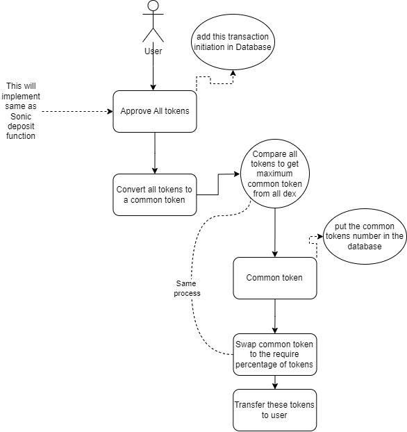

# AppIC_multiswap

## Token Actor and Canister Definitions

- The actor defines different types of token actors such as `TokenActor`, `ICRC1TokenActor`, and `ICRC2TokenActor, each with specific methods for interacting with token canisters.

## Transfer Receipt Structure

- The `TransferReceipt` type outlines the structure indicating a successful transfer with a transaction ID or an error message.

## Private Data and Counter

- The actor maintains private data structures for user token locks and a stable `txcounter` variable to track the number of transactions.

### **\_getTokenActorWithType Function**

- This private function retrieves the appropriate token actor based on the provided token ID and type.

### **\_transferFrom Function**

- This function handles the transfer of tokens from the caller to the target canister. It supports different token canister types like DIP20, ICRC1, and ICRC2.

### **\_transfer Function**

- Facilitates the token transfer between the caller and a specified token canister, handling different token types appropriately.

### **transferTokensToCanister Function**

- Enables transferring tokens from the caller to a target token canister. It updates the user's token data and balance upon successful transfer.

### **withdrawTokens Function**

- Allows the caller to withdraw tokens of a specific type. It handles updating user data, transferring tokens, and setting the token balance to zero after withdrawal.

### **getAllUserTokens Query**

- This function retrieves all tokens locked by a specific user and returns the list of token IDs along with their respective amounts.
